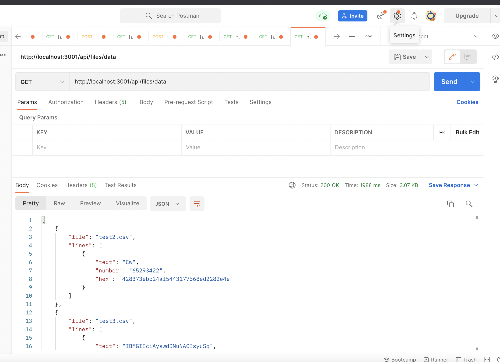

# Code Challenge Backend

## Localhost deploy npm

1. Run the command `npm install`.
2. Run the command `npm start`.
3. Visit [http://localhost:3001/api/files/data](http://localhost:3001/api/files/data).

